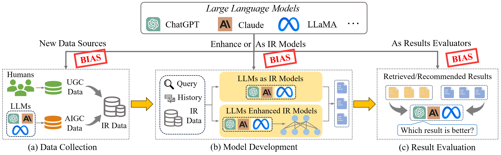
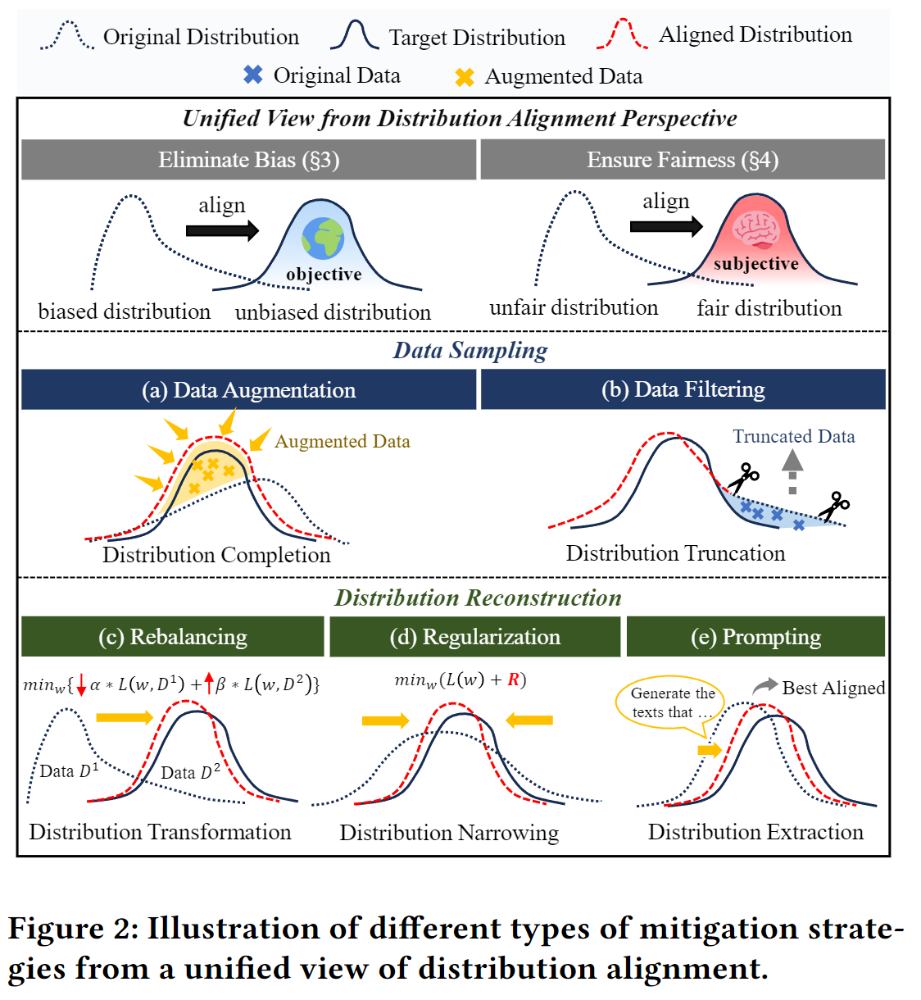

# Survey: LLM-IR-Bias-Fairness
This is the collection of papers related to bias and fairness in IR with LLMs. These papers are organized according to our survey paper **Unifying Bias and Unfairness in Information Retrieval: A Survey of Challenges and Opportunities with Large Language Models**.

Please feel free to contact us if you have any questions or suggestions!

## 📋 Contents
- [Introduction](#-introduction)
- [Paper List](#-paper-list)
  - [Bias](#bias)
    - [Bias in Data Collection](#bias-in-data-collection)
    - [Bias in Model Development](#bias-in-model-development)
    - [Bias in Result Evaluation](#bias-in-result-evaluation)
  - [Unfairness](#unfairness)
    - [Unfairness in Data Collection](#unfairness-in-data-collection)
    - [Unfairness in Model Development](#unfairness-in-model-development)
    - [Unfairness in Result Evaluation](#unfairness-in-result-evaluation)
- [Contribution](#contribution)

## 🌟 Introduction
In this survey, we provide a comprehensive review of emerging and pressing issues related to bias and unfairness in three key stages of the integration of LLMs into IR systems.

   

We introduce a unified framework to understand these issues as distribution mismatch problems and systematically categorize mitigation strategies into data sampling and distribution reconstruction approaches.

   

  
## 📄 Paper List

### Bias
#### Bias in Data Collection
1. **LLMs may Dominate Information Access: Neural Retrievers are Biased Towards LLM-Generated Texts**, Preprint 2023. [[Paper]](https://arxiv.org/abs/2310.20501)  
2. **AI-Generated Images Introduce Invisible Relevance Bias to Text-Image Retrieval**, Preprint 2023. [[Paper]](https://arxiv.org/abs/2311.14084)  
3. **Blinded by Generated Contexts: How Language Models Merge Generated and Retrieved Contexts for Open-Domain QA?**, Preprint 2024. [[Paper]](https://arxiv.org/abs/2401.11911) 
4. **Textbooks Are All You Need** , Preprint 2023. [[Paper]](https://arxiv.org/abs/2306.11644)   
5. **Measuring and Narrowing the Compositionality Gap in Language Models**, Findings of EMNLP 2023 [[Paper]](https://arxiv.org/abs/2210.03350)   
6. **In-Context Retrieval-Augmented Language Models**, TACL 2023 [[Paper]](https://direct.mit.edu/tacl/article/doi/10.1162/tacl_a_00605/118118)  
7. **Search-in-the-Chain: Interactively Enhancing Large Language Models with Search for Knowledge-intensive Tasks**, WWW 2024 [[Paper]](https://arxiv.org/abs/2304.14732)  
8. **List-aware Reranking-Truncation Joint Model for Search and Retrieval-augmented Generation**, WWW 2024 [[Paper]](https://arxiv.org/abs/2402.02764)  
9. **Unsupervised Information Refinement Training of Large Language Models for Retrieval-Augmented Generation**, Preprint 2024 [[Paper]](https://arxiv.org/abs/2402.18150)  
10. **Improving Language Models via Plug-and-Play Retrieval Feedback**, Preprint 2024 [[Paper]](https://arxiv.org/abs/2305.14002)  
11. **Llama 2: Open Foundation and Fine-Tuned Chat Models**, Preprint 2023 [[Paper]](https://arxiv.org/abs/2307.09288)  
12. **Unified Detoxifying and Debiasing in Language Generation via Inference-time Adaptive Optimization**, ICLR 2023 [[Paper]](https://arxiv.org/abs/2210.04492)  
13. **Recitation-Augmented Language Models**, ICLR 2023 [[Paper]](https://arxiv.org/abs/2210.01296)  
14. **Self-Consistency Improves Chain of Thought Reasoning in Language Models**, ICLR 2023  [[Paper]](https://arxiv.org/abs/2203.11171)  

#### Bias in Model Development
1. **Large Language Models are Zero-Shot Rankers for Recommender Systems**, ECIR 2024. [[Paper]](https://arxiv.org/abs/2305.08845)    
2. **Found in the Middle: Permutation Self-Consistency Improves Listwise Ranking in Large Language Models**, Preprint 2023. [[Paper]](https://arxiv.org/abs/2310.07712)  
3. **RecRanker: Instruction Tuning Large Language Model as Ranker for Top-k Recommendation**, Preprint 2023. [[Paper]](https://arxiv.org/abs/2312.16018)  
4. **Large Language Models are Effective Text Rankers with Pairwise Ranking Prompting**, Preprint 2023. [[Paper]](https://arxiv.org/abs/2306.17563)  
5. **Exploring Large Language Model for Graph Data Understanding in Online Job Recommendations**, Preprint 2023. [[Paper]](https://arxiv.org/abs/2307.05722)   
6. **Large Language Models are Not Stable Recommender Systems**, Preprint 2023. [[Paper]](https://arxiv.org/abs/2312.15746)  
7. **A Bi-Step Grounding Paradigm for Large Language Models in Recommendation Systems**, Preprint 2023. [[Paper]](https://arxiv.org/abs/2308.08434) 
8. **Large Language Models as Zero-Shot Conversational Recommenders**, CIKM 2023. [[Paper]](https://arxiv.org/abs/2308.10053) 
9. **Improving Conversational Recommendation Systems via Bias Analysis and Language-Model-Enhanced Data Augmentation**, EMNLP 2023. [[Paper]](https://arxiv.org/abs/2310.16738)  
10. **Understanding Biases in ChatGPT-based Recommender Systems: Provider Fairness, Temporal Stability, and Recency**, Preprint 2024. [[Paper]](https://arxiv.org/abs/2401.10545)  
11. **ChatGPT for Conversational Recommendation: Refining Recommendations by Reprompting with Feedback**, Preprint 2024. [[Paper]](https://arxiv.org/abs/2401.03605)  
12. **Cross-Task Generalization via Natural Language Crowdsourcing Instructions**, ACL 2022  [[Paper]](https://arxiv.org/abs/2104.08773)  
13. **Multitask Prompted Training Enables Zero-Shot Task Generalization**, ICLR 2022 [[Paper]](https://arxiv.org/abs/2110.08207)  
14. **Self-Instruct: Aligning Language Models with Self-Generated Instructions**, ACL 2023 [[Paper]](https://arxiv.org/abs/2212.10560)  
15. **Bridging the Gap: A Survey on Integrating (Human) Feedback for Natural Language Generation**, TACL 2023 [[Paper]](https://direct.mit.edu/tacl/article/doi/10.1162/tacl_a_00626/118795)  
16. **Investigating the Effectiveness of Task-Agnostic Prefix Prompt for Instruction Following**, AAAI 2024 [[Paper]](https://arxiv.org/abs/2302.14691)  
17. **LongAlign: A Recipe for Long Context Alignment of Large Language Models**, Preprint 2024. [[Paper]](https://arxiv.org/abs/2309.13701)  
18. **Data Engineering for Scaling Language Models to 128K Context**, Preprint 2024. [[Paper]](https://arxiv.org/abs/2402.10171)  

#### Bias in Result Evaluation
1. **Large Language Models Are Not Robust Multiple Choice Selectors**, ICLR 2024. [[Paper]](https://arxiv.org/abs/2309.03882)  
2. **Humans or LLMs as the Judge? A Study on Judgement Biases**, Preprint 2024. [[Paper]](https://arxiv.org/abs/2402.10669)  
3. **Benchmarking Cognitive Biases in Large Language Models as Evaluators**, Preprint 2023. [[Paper]](https://arxiv.org/abs/2309.17012)   
4. **Large Language Models Sensitivity to The Order of Options in Multiple-Choice Questions**, Preprint 2023. [[Paper]](https://arxiv.org/abs/2308.11483)   
5. **Large Language Models are not Fair Evaluators**, Preprint 2023. [[Paper]](https://arxiv.org/abs/2305.17926)    
6. **Judging LLM-as-a-Judge with MT-Bench and Chatbot Arena**, NeurIPS 2023. [[Paper]](https://arxiv.org/abs/2306.05685)     
7. **Can Large Language Models be Trusted for Evaluation? Scalable Meta-Evaluation of LLMs as Evaluators via Agent Debate**, Preprint 2024. [[Paper]](https://arxiv.org/abs/2401.16788)  
8. **EvalLM: Interactive Evaluation of Large Language Model Prompts on User-Defined Criteria**, CHI 2024. [[Paper]](https://arxiv.org/abs/2309.13633)  
9. **LLMs as Narcissistic Evaluators: When Ego Inflates Evaluation Scores**, Preprint 2023. [[Paper]](https://arxiv.org/abs/2311.09766)  
10. **Verbosity Bias in Preference Labeling by Large Language Models**, Preprint 2023. [[Paper]](https://arxiv.org/abs/2310.10076) 
11. **Style Over Substance: Evaluation Biases for Large Language Models**, Preprint 2023. [[Paper]](https://arxiv.org/abs/2310.10076)  
12. **An Empirical Study of LLM-as-a-Judge for LLM Evaluation: Fine-tuned Judge Models are Task-specific Classifiers**, Preprint 2024. [[Paper]](https://arxiv.org/abs/2403.02839) 
13. **G-Eval: NLG Evaluation using GPT-4 with Better Human Alignment**, Preprint 2023. [[Paper]](https://arxiv.org/abs/2303.16634)   
14. **PRD: Peer Rank and Discussion Improve Large Language Model based Evaluations**, Preprint 2023. [[Paper]](https://arxiv.org/abs/2307.02762)  
15. **ALLURE: Auditing and Improving LLM-based Evaluation of Text using Iterative In-Context-Learning**, Preprint 2023. [[Paper]](https://arxiv.org/abs/2309.13701)  
16. **Teacher-Student Training for Debiasing: General Permutation Debiasing for Large Language Models**, Preprint 2024. [[Paper]](https://arxiv.org/abs/2403.13590)  
17. **PRE: A Peer Review Based Large Language Model Evaluator**, Preprint 2024. [[Paper]](https://arxiv.org/abs/2401.15641)  
18. **Aligning with Human Judgement: The Role of Pairwise Preference in Large Language Model Evaluators**, Preprint 2024. [[Paper]](https://arxiv.org/abs/2403.16950)  

### Unfairness
#### Unfairness in Data Collection
1. **Measuring and Mitigating Unintended Bias in Text Classification**, AIES 2018. [[Paper]](https://dl.acm.org/doi/10.1145/3278721.3278729)  
2. **Gender-tuning: Empowering Fine-tuning for Debiasing Pre-trained Language Models**, ACL 2023. [[Paper]](https://aclanthology.org/2023.findings-acl.336/)  
3. **Gender Bias in Neural Natural Language Processing**, Preprint 2019. [[Paper]](https://arxiv.org/abs/1807.11714)  
4. **MoralDial: A Framework to Train and Evaluate Moral Dialogue Systems via Moral Discussions**, ACL 2023. [[Paper]](https://aclanthology.org/2023.acl-long.123/)  
5. **SaFeRDialogues: Taking Feedback Gracefully after Conversational Safety Failures**, ACL 2022. [[Paper]](https://aclanthology.org/2022.acl-long.447/)  
6. **Do LLMs Implicitly Exhibit User Discrimination in Recommendation? An Empirical Study**, Preprint 2023. [[Paper]](https://arxiv.org/abs/2311.07054)  
7. **Is ChatGPT Fair for Recommendation? Evaluating Fairness in Large Language Model Recommendation**, Recsys 2023. [[Paper]](https://dl.acm.org/doi/10.1145/3604915.3608860)  
8. **Mitigating harm in language models with conditional-likelihood filtration**, Preprint 2021. [[Paper]](https://arxiv.org/abs/2108.07790)  
9. **Exploring the limits of transfer learning with a unified text-to-text transformer**, JMLR 2020. [[Paper]](https://jmlr.org/papers/volume21/20-074/20-074.pdf)  
10. **CFaiRLLM: Consumer Fairness Evaluation in Large-Language Model Recommender System**, Preprint 2024. [[Paper]](https://arxiv.org/abs/2403.05668)  
11. **BLIND: Bias Removal With No Demographics**, ACL 2023. [[Paper]](https://aclanthology.org/2023.acl-long.490/)  
12. **Identifying and Reducing Gender Bias in Word-Level Language Models**, NAACL 2019. [[Paper]](https://aclanthology.org/N19-3002.pdf)  
13. **Reducing Sentiment Bias in Language Models via Counterfactual Evaluation**， Findings-EMNLP' 20. [[Paper]](https://aclanthology.org/2020.findings-emnlp.7/)  
14. **Reducing Gender Bias in Word-Level Language Models with a Gender-Equalizing Loss Function**, ACL-workshop 2019. [[Paper]](https://aclanthology.org/P19-2031/)  
15. **Bias of AI-Generated Content: An Examination of News Produced by Large Language Models**, Preprint 2023. [[Paper]](https://arxiv.org/abs/2309.09825)  
16. **Educational Multi-Question Generation for Reading Comprehension**, BEA-workshop 2022 [[Paper]](https://aclanthology.org/2022.bea-1.26/)  
17. **Pseudo-Discrimination Parameters from Language Embeddings**, Preprint 2024 [[Paper]](https://osf.io/preprints/psyarxiv/9a4qx)  
18. **Item-side Fairness of Large Language Model-based Recommendation System**, WWW 2024 [[Paper]](https://arxiv.org/abs/2402.15215)  
19. **Bias of AI-generated content: an examination of news produced by large language models**, Scientific Reports [[Paper]](https://www.nature.com/articles/s41598-024-55686-2)  
20. **Generating Better Items for Cognitive Assessments Using Large Language Models**, BEA-workshop 2023 [[Paper]](https://aclanthology.org/2023.bea-1.34/)  

#### Unfairness in Model Development
1. **Dynamically disentangling social bias from task-oriented representations with adversarial attack**, NAACL 2021 [[Paper]](https://aclanthology.org/2021.naacl-main.293/)  
2. **Using In-Context Learning to Improve Dialogue Safety**, EMNLP-findings 2023 [[Paper]](https://aclanthology.org/2023.findings-emnlp.796/)  
3. **Large pre-trained language models contain human-like biases of what is right and wrong to do**, NML 2023 [[Paper]](https://www.nature.com/articles/s42256-022-00458-8)  
4. **BlenderBot 3: a deployed conversational agent that continually learns to responsibly engage**, Preprint 2022 [[Paper]](https://arxiv.org/abs/2208.03188)  
5. **Balancing out Bias: Achieving Fairness Through Balanced Training**, EMNLP 2022 [[Paper]](https://aclanthology.org/2022.emnlp-main.779/)  
6. **Should We Attend More or Less? Modulating Attention for Fairness**, Preprint 2023 [[Paper]](https://arxiv.org/abs/2305.13088)  
7. **Constitutional AI: Harmlessness from AI Feedback**, reprint 2022 [[Paper]](https://arxiv.org/abs/2212.08073)  
8. **He is very intelligent, she is very beautiful? On Mitigating Social Biases in Language Modelling and Generation**, ACL-findings 2021 [[Paper]](https://aclanthology.org/2021.findings-acl.397/)  
9. **Does Gender Matter? Towards Fairness in Dialogue Systems**, COLING 2020 [[Paper]](https://aclanthology.org/2020.coling-main.390/)  
10. **Training language models to follow instructions with human feedback**, NeurIPS 2022 [[Paper]](https://proceedings.neurips.cc/paper_files/paper/2022/hash/b1efde53be364a73914f58805a001731-Abstract-Conference.html)  
11. **Never Too Late to Learn: Regularizing Gender Bias in Coreference Resolution**, WSDM 2023 [[Paper]](https://dl.acm.org/doi/abs/10.1145/3539597.3570473)  
12. **CFaiRLLM: Consumer Fairness Evaluation in Large-Language Model Recommender System**, Preprint 2024 [[Paper]](https://arxiv.org/abs/2403.05668)  
13. **UP5: Unbiased Foundation Model for Fairness-aware Recommendation**, EACL 2024 [[Paper]](https://aclanthology.org/2024.eacl-long.114/)  
14. **ADEPT: A DEbiasing PrompT Framework**, AAAI 2023 [[Paper]](https://ojs.aaai.org/index.php/AAAI/article/view/26279/26051)  
15. **Is ChatGPT Fair for Recommendation? Evaluating Fairness in Large Language Model Recommendation**, Recsys 2023. [[Paper]](https://dl.acm.org/doi/10.1145/3604915.3608860)  
16. **Automatic Generation of Distractors for Fill-in-the-Blank Exercises with Round-Trip Neural Machine Translation**, ACL-workshop2023. [[Paper]](https://aclanthology.org/2022.acl-srw.31/)  
17. **Increasing Diversity While Maintaining Accuracy: Text Data Generation with Large Language Models and Human Interventions**, ACL 2023  [[Paper]](https://aclanthology.org/2023.acl-long.34/)  
18. **Critic-Guided Decoding for Controlled Text Generation**, ACL-finding 2023 [[Paper]](https://aclanthology.org/2023.findings-acl.281/)  
19. **Item-side Fairness of Large Language Model-based Recommendation System**, WWW 2024 [[Paper]](https://arxiv.org/abs/2402.15215)  
20. **Fair Diffusion: Instructing Text-to-Image Generation Models on Fairness**, Preprint 2023 [[Paper]](https://arxiv.org/abs/2302.10893)  
21. **Understanding Biases in ChatGPT-based Recommender Systems: Provider Fairness, Temporal Stability, and Recency**, Preprint 2024 [[Paper]](https://arxiv.org/abs/2401.10545)  
22. **A Preliminary Study of ChatGPT on News Recommendation: Personalization, Provider Fairness, Fake News**, Preprint 2023 [[Paper]](https://arxiv.org/abs/2306.10702)  

    
#### Unfairness in Result Evaluation
1. **Estimating the Personality of White-Box Language Models**, Preprint 2022 [[Paper]](https://arxiv.org/abs/2204.12000)  
2. **Tailoring Personality Traits in Large Language Models via Unsupervisedly-Built Personalized Lexicons**, Preprint 2022 [[Paper]](https://arxiv.org/abs/2310.16582)  
3. **FairMonitor: A Four-Stage Automatic Framework for Detecting Stereotypes and Biases in Large Language Models**, Preprint 2023 [[Paper]](https://arxiv.org/abs/2308.10397)  
4. **Evaluating and Inducing Personality in Pre-trained Language Models**, NeurIPS 2023 [[Paper]](https://arxiv.org/abs/2206.07550)  
5. **Do LLMs Possess a Personality? Making the MBTI Test an Amazing Evaluation for Large Language Models**, Preprint 2023 [[Paper]](https://arxiv.org/abs/2307.16180)  
6. **Studying Large Language Model Generalization with Influence Functions**, Preprint 2023 [[Paper]](https://arxiv.org/abs/2308.03296)  
7. **Towards Tracing Knowledge in Language Models Back to the Training Data**, EMNLP findings 2023 [[Paper]](https://aclanthology.org/2022.findings-emnlp.180/)  
8. **Detecting Pretraining Data from Large Language Models**, Preprint 2023   [[Paper]](https://arxiv.org/abs/2310.16789)  
9. **Watermarking Makes Language Models Radioactive**, Preprint 2024 [[Paper]](https://arxiv.org/abs/2402.14904)  
10. **WASA: WAtermark-based Source Attribution for Large Language Model-Generated Data**, Preprint 2023 [[Paper]](https://arxiv.org/abs/2310.00646)  
11. **User Behavior Simulation with Large Language Model based Agents**, Preprint 2023 [[Paper]](https://arxiv.org/abs/2306.02552)  
12. **On Generative Agents in Recommendation**, Preprint 2023 [[Paper]](https://arxiv.org/abs/2310.10108)  

## Contribution
:tada::+1: Please feel free to open an issue or make a pull request! :tada::+1:

